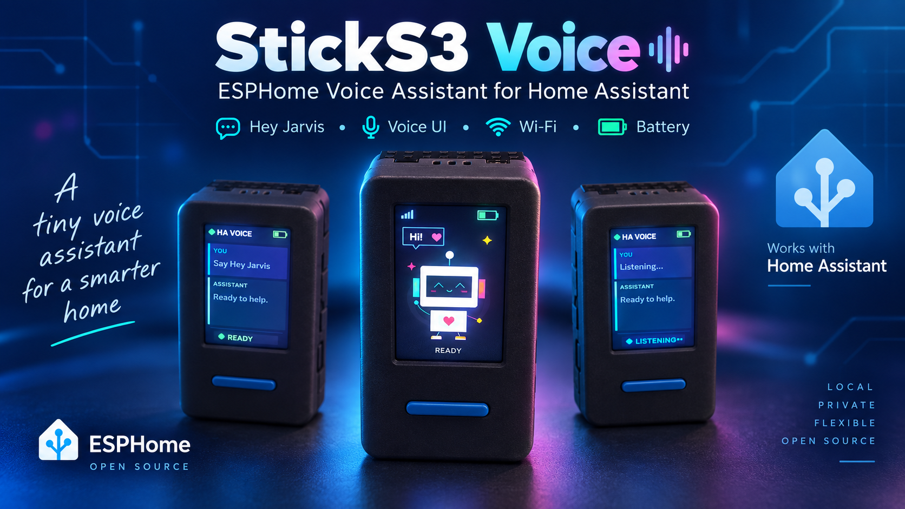

# StickS3 Voice

[English](README.md) | [简体中文](README_zh-CN.md)

ESPHome voice-assistant firmware made specifically for the **M5Stack StickS3 K150 / StickS3**. This is not a generic ESP32-S3 firmware image and should only be installed on the matching StickS3 hardware.



## Features

- Home Assistant voice satellite
- On-device `hey_jarvis` wake word
- Microphone and speaker support through the StickS3 ES8311 audio codec
- 135 × 240 color LCD with an animated candy-colored robot
- Listening, thinking, and speaking status screens
- Speech transcript and assistant response text on the display
- Battery status icon and Wi-Fi signal on the display
- Battery percentage, battery voltage, and Wi-Fi signal sensors in Home Assistant
- Voice activation using the front button
- Automatic return to the robot screen after a completed response
- Wi-Fi provisioning through USB or the fallback setup portal
- OTA updates after the device joins the network
- Unique device names using a MAC-address suffix

## Supported hardware

This project targets the **M5Stack StickS3 K150 / StickS3**, including:

- ESP32-S3-PICO-1-N8R8
- 8 MB flash
- 8 MB PSRAM
- 1.14-inch 135 × 240 ST7789P3 color LCD
- ES8311 audio codec
- Built-in microphone
- Built-in speaker
- Front button
- 250 mAh battery

The StickS3 also includes infrared hardware, an IMU, and an expansion port, but this firmware does not currently enable those features.

Bluetooth Proxy is intentionally disabled to reduce its possible impact on Wi-Fi and voice-assistant performance.

## Install from the web

Regular users do not need to install ESPHome, download the source code, or create a GitHub repository.

1. Open the [StickS3 Voice web installer](https://thenexthop2025.github.io/sticks3-voice/) using desktop Google Chrome or Microsoft Edge.
2. Connect the StickS3 to the computer using a USB data cable.
3. Select **Connect**.
4. Choose the USB serial port belonging to the StickS3.
5. Follow the instructions shown by the installer.
6. Keep the device connected until flashing and verification are complete.
7. Restart the device and configure Wi-Fi after installation.

Web installation replaces the firmware currently installed on the device and may clear existing network and device settings. Back up any configuration you need before flashing.

## Download the compiled firmware

Users who prefer another flashing tool can download the compiled firmware directly:

[Download firmware.factory.bin](https://thenexthop2025.github.io/sticks3-voice/firmware.factory.bin)

This is a factory image intended for a complete first-time installation and can be written at offset `0x0`.

## Browser requirements

The recommended desktop browsers are:

- Google Chrome
- Microsoft Edge

Web installation requires Web Serial support, and the installer must be served over HTTPS. GitHub Pages provides HTTPS automatically.

Safari and browsers on iPhone or iPad do not support this installation flow. Phones and tablets are not recommended for flashing.

If the StickS3 does not appear in the serial-port list:

1. Confirm that the USB cable supports data transfer and is not a charging-only cable.
2. Connect directly to the computer when possible instead of using a hub.
3. Close other applications that may be using the serial port.
4. Reconnect the device and reload the installer.
5. If download mode is required, connect USB and hold the side button for approximately two seconds.
6. Release the button when the internal green LED begins flashing.
7. Select **Connect** again.

Do not select the following built-in macOS ports:

```text
cu.Bluetooth-Incoming-Port
cu.debug-console
cu.wlan-debug
```

The StickS3 normally appears as a new USB, Espressif, or `cu.usbmodem` port.

## First-time Wi-Fi setup

After firmware installation, keep the StickS3 connected to the computer over USB.

The installer may automatically offer a Wi-Fi configuration option. If it appears, select your Wi-Fi network and enter its password.

If the Wi-Fi configuration option does not appear:

1. Wait for the StickS3 to finish starting.
2. Open the Wi-Fi settings on a phone or computer.
3. Find and connect to:

```text
StickS3 Voice Setup
```

4. The temporary setup network currently has no password.
5. The setup page should normally open automatically.
6. Select your Wi-Fi network and enter its password.

If the setup page does not open automatically, visit:

```text
http://192.168.4.1/
```

After the device successfully joins the home Wi-Fi network, it uses the configured network for normal operation.

`StickS3 Voice Setup` is a fallback provisioning network used when the device cannot connect to another Wi-Fi network. It is not the device’s normal everyday network.

## Add to Home Assistant

1. Make sure the StickS3 and Home Assistant can reach each other on the same network.
2. In Home Assistant, open **Settings → Devices & services**.
3. Look for a discovered ESPHome device.
4. If it is discovered, follow the prompt to add it.
5. If it is not discovered automatically, select **Add integration → ESPHome**.
6. Enter the StickS3 hostname or IP address.
7. Complete the ESPHome device setup.
8. Select the Home Assistant Assist pipeline and language that the device should use.

The device hostname normally begins with `sticks3-voice`. A MAC-address suffix is enabled, so the complete hostname may be different for each device.

No Home Assistant API key belonging to the project author is embedded in the firmware.

## Wake and use the assistant

After the device is connected to Home Assistant, start the voice assistant in either of these ways:

- Say the wake phrase: `Hey Jarvis`
- Press the blue front button

The display indicates the current state:

- Listening
- Thinking
- Speaking

The display also shows the speech transcript and the Home Assistant response. After the response is complete, the device automatically returns to the robot screen.

## Build and flash locally

Advanced users can install ESPHome 2026.9.x and run the following command from the project directory:

```bash
esphome run sticks3-voice.yaml
```

For a compile-only build:

```bash
esphome compile sticks3-voice.yaml
```

Local build output is written to the `.esphome` build directory.

The first installation can be performed over USB. After the device joins the network, it can be adopted into a personal ESPHome Dashboard and maintained using OTA updates.

## Automated GitHub Pages deployment

The included GitHub Actions workflow automatically performs the following steps after each push to the `main` branch:

1. Installs ESPHome 2026.9.x.
2. Compiles `sticks3-voice.yaml`.
3. Locates the generated `firmware.factory.bin`.
4. Builds the web installer.
5. Deploys the installer and firmware to GitHub Pages.

The workflow can also be started manually from the repository’s **Actions** tab.

After every successful deployment, the installer remains available at the same address:

```text
https://thenexthop2025.github.io/sticks3-voice/
```

Regular users do not need to operate GitHub or run the Actions workflow themselves.

## Project files

| Path | Purpose |
| --- | --- |
| `sticks3-voice.yaml` | ESPHome firmware configuration |
| `docs/sticks3-hardware.png` | StickS3 hardware reference image used by both README files |
| `site/index.html` | Browser-based installer page |
| `site/manifest.json` | ESP Web Tools firmware manifest |
| `.github/workflows/pages.yml` | Automatic firmware build and GitHub Pages deployment |
| `README.md` | English documentation |
| `README_zh-CN.md` | Simplified Chinese documentation |

## Notes

- If the battery icon disappears after entering download mode, disconnect USB, double-click the side button to power the device off completely, wait approximately ten seconds, and then press the button once to power it on.
