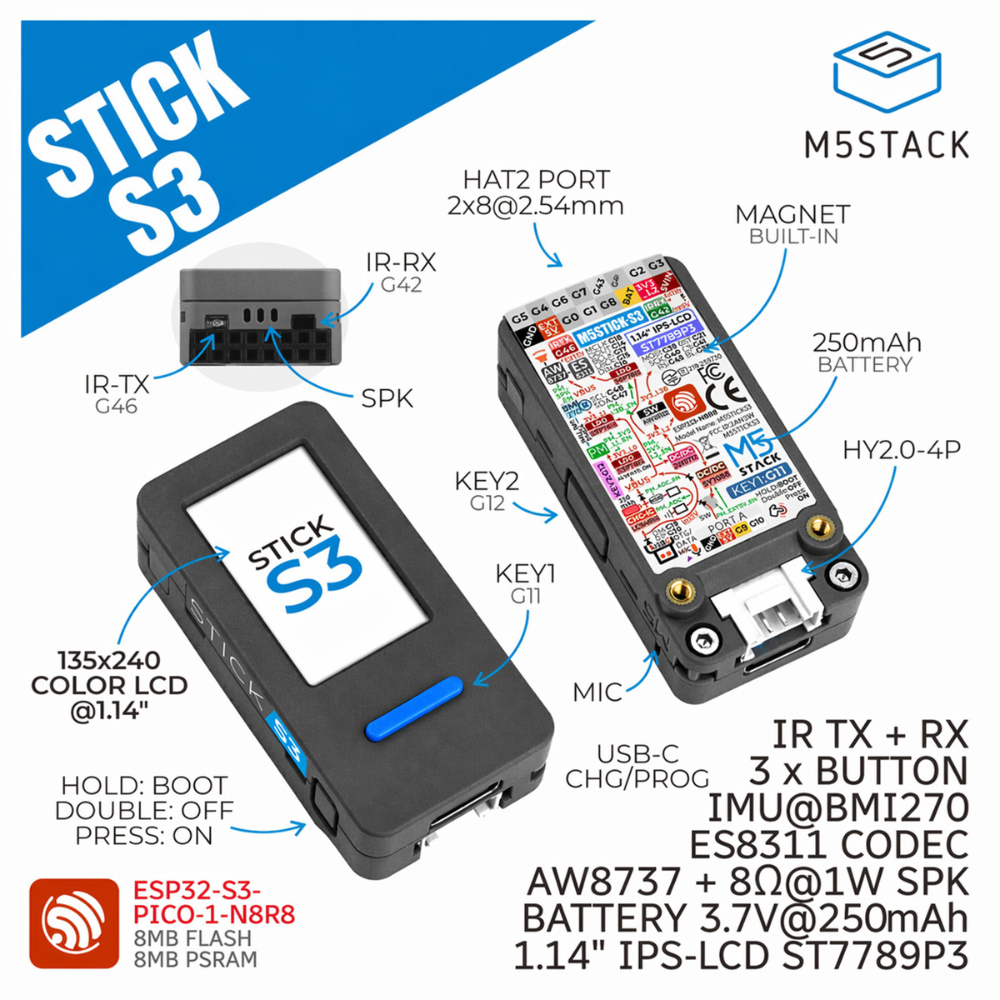

# StickS3 Voice

[English](README.md) | [简体中文](README_zh-CN.md)

这是专门为 **M5Stack StickS3 K150 / StickS3** 制作的 ESPHome 语音助手固件。它不是通用的 ESP32-S3 固件，请只在对应的 StickS3 硬件上使用。



## 功能

- Home Assistant 语音卫星，使用设备端 `hey_jarvis` 唤醒词
- 通过 StickS3 的 ES8311 音频编解码器使用麦克风和扬声器
- 135 × 240 彩色 LCD，显示糖果色动态机器人
- 显示正在聆听、思考和播报等语音状态
- 在屏幕上显示语音识别文本和助手回复
- 显示电池百分比、电池电压和 Wi-Fi 信号
- 支持正面按键唤醒，回答结束后自动返回待机画面
- 可通过 Improv Serial 或备用配网页面完成 Wi-Fi 设置
- 设备联网后可使用 OTA 更新
- 自动在设备名后加入 MAC 地址后缀，避免多台设备重名

## 支持的硬件

本项目适用于 **M5Stack StickS3 K150 / StickS3**：ESP32-S3-PICO-1-N8R8、8 MB Flash、8 MB PSRAM、1.14 英寸 ST7789P3 LCD、ES8311 音频编解码器、麦克风、扬声器、按键和 250 mAh 电池。

这块开发板还带有红外、IMU 和扩展接口，但当前固件没有启用这些功能。Bluetooth Proxy 也有意保持关闭。

## 隐私与公开分享

本仓库不包含个人 Wi-Fi 凭据，也不包含固定的 Home Assistant API 加密密钥。每位用户都应在刷机后配置自己的网络，并将设备接入自己的 Home Assistant。

发布修改前，请勿把 `secrets.yaml`、Wi-Fi 密码、Home Assistant 令牌、API 密钥或其他私人信息提交到仓库。

## 通过 GitHub Pages 一键安装

把本项目推送到 GitHub，并在 Pages 设置中选择 **GitHub Actions** 作为发布来源后：

1. 打开 `https://<github-user>.github.io/sticks3-voice/`。
2. 使用支持数据传输的 USB 线把 StickS3 连接到电脑。
3. 点击 **Install**，选择对应的串口设备并确认安装。
4. 在刷写和校验完成前保持设备连接。

项目中的工作流会在每次推送到 `main` 分支时编译 `sticks3-voice.yaml`、查找 `firmware.factory.bin`、生成安装网站并发布到 GitHub Pages。也可以在 GitHub 的 **Actions** 页面手动启动它。

## 浏览器要求

网页刷机依赖 Web Serial。请使用最新版桌面端 Chromium 浏览器，例如 Google Chrome 或 Microsoft Edge。Safari、Firefox 和大多数手机浏览器不支持此刷机流程。安装页面必须通过 HTTPS 提供，GitHub Pages 会自动满足这个要求。如果看不到串口设备，请确认 USB 线支持数据传输、关闭正在占用串口的其他程序，然后重新连接设备。

## 首次配网

刷机完成后，可以用以下任一方式配置 Wi-Fi：

- 设备通过 USB 连接时，在安装页面或浏览器中完成 Improv Serial 配网。
- 连接设备临时创建的 **StickS3 Voice Setup** Wi-Fi，随后在弹出的配网页面中输入自己的 Wi-Fi 名称和密码。

这个热点只用于初次配网。设备成功连接你的 Wi-Fi 后，不会把它作为日常网络连接使用。

## 接入 Home Assistant

1. 确保 StickS3 与 Home Assistant 位于可以互相访问的网络中。
2. 在 Home Assistant 中打开 **设置 → 设备与服务**。
3. 接受自动发现的 ESPHome 设备；如果没有自动发现，选择 **添加集成 → ESPHome**，并输入设备主机名或 IP 地址。
4. 按照界面完成当前 Home Assistant 环境的 ESPHome 配对。
5. 设置语音助手要使用的 Home Assistant Assist 管线和语言。

固件中没有内置属于项目作者的 API 密钥。

## 本地编译和刷机

安装 ESPHome 2026.9.x 后运行：

```bash
esphome run sticks3-voice.yaml
```

如果只需要编译：

```bash
esphome compile sticks3-voice.yaml
```

首次使用时，ESPHome 可以通过 USB 为设备配网。也可以把设备接管到自己的 ESPHome Dashboard，再在那里维护私人配置。

## 项目文件说明

| 路径 | 用途 |
| --- | --- |
| `sticks3-voice.yaml` | ESPHome 固件配置 |
| `docs/sticks3-hardware.png` | 两个 README 共用的 StickS3 硬件参考图 |
| `site/index.html` | 浏览器一键安装页面 |
| `site/manifest.json` | ESP Web Tools 固件清单 |
| `.github/workflows/pages.yml` | 自动编译固件并发布 GitHub Pages |
| `.gitignore` | 排除本地 ESPHome 构建结果、私密配置和生成的固件 |
| `README.md` | 英文说明 |
| `README_zh-CN.md` | 简体中文说明 |

## 注意事项

- GitHub Actions 工作流固定使用 ESPHome 2026.9.x，以便公开构建结果保持一致。
- 刷机会替换设备当前固件，请先备份需要保留的配置。
- 这是针对上图所示硬件的社区项目，不是适用于其他 ESP32-S3 开发板的通用固件。
